# TaskManagerApp

**Phần mềm quản lý công việc thông minh** — giúp bạn tổ chức, theo dõi và hoàn thành mọi công việc hiệu quả: từ lên kế hoạch, phân công đến giám sát tiến độ.

Ứng dụng di động đa nền tảng (Flutter) kết hợp backend Node.js, Firebase và Dropbox — phù hợp cho cá nhân, nhóm nhỏ và môi trường học tập/dự án.

<p align="center">
  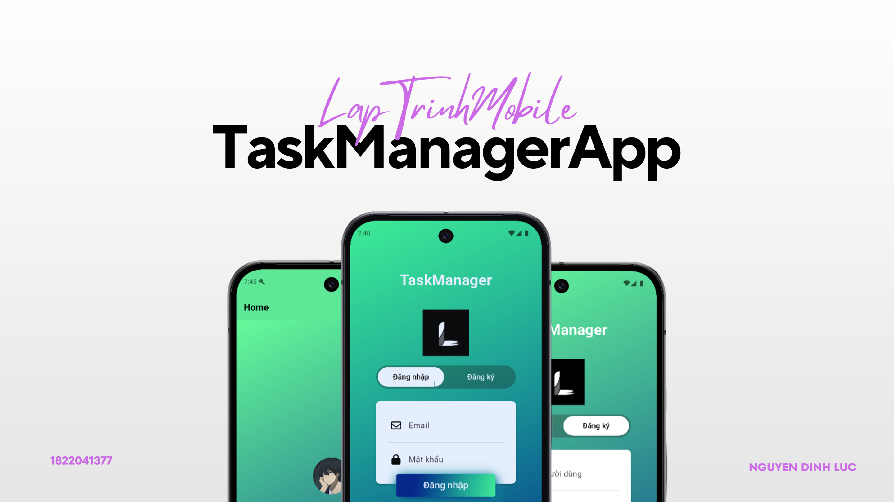
</p>

---

## Mục lục

- [Tổng quan](#tổng-quan)
- [Tính năng](#tính-năng)
- [Điểm nổi bật so với app trên thị trường](#điểm-nổi-bật-so-với-app-trên-thị-trường)
- [Demo giao diện](#demo-giao-diện)
- [Kiến trúc hệ thống](#kiến-trúc-hệ-thống)
- [Công nghệ sử dụng](#công-nghệ-sử-dụng)
- [Cấu trúc thư mục](#cấu-trúc-thư-mục)
- [Cài đặt & chạy dự án](#cài-đặt--chạy-dự-án)
- [Tài liệu demo đầy đủ](#tài-liệu-demo-đầy-đủ)
- [Tác giả](#tác-giả)
- [Giấy phép](#giấy-phép)

---

## Tổng quan

**TaskManagerApp** là ứng dụng quản lý công việc (task management) với giao diện hiện đại, hỗ trợ tiếng Việt. Người dùng có thể đăng ký/đăng nhập, tạo và giao việc cho thành viên khác, theo dõi trạng thái theo Kanban hoặc danh sách, đính kèm tệp và lọc công việc theo nhiều tiêu chí.

| Thành phần | Mô tả |
|------------|--------|
| **Client** | Flutter (Android, iOS, Windows, Web, …) |
| **API** | Express.js (`task-manager-api-firebase`) |
| **Xác thực & dữ liệu người dùng** | Firebase Authentication + Cloud Firestore |
| **Lưu trữ tệp đính kèm** | Dropbox API |

---

## Tính năng

### Xác thực & tài khoản

- Đăng ký tài khoản bằng **email / mật khẩu** (Firebase Auth + Firestore).
- Đăng nhập bằng **Google** (Google Sign-In + Firebase).
- Màn hình đăng nhập/đăng ký trên **một màn hình** với chuyển tab mượt (PageView + animation).
- Trang chủ hiển thị **avatar, tên, email** và nút đăng xuất.

### Quản lý công việc

- **CRUD** đầy đủ: tạo, xem chi tiết, chỉnh sửa, xóa công việc.
- Trường thông tin phong phú:
  - Tiêu đề, mô tả
  - Trạng thái: `To do` · `In progress` · `Done` · `Cancelled`
  - Độ ưu tiên: Thấp · Trung bình · Cao (cờ màu trên UI)
  - Danh mục: `Work` · `Personal` · `Study`
  - Hạn chót (date picker)
  - **Giao việc** cho người dùng khác trong hệ thống (`assignedTo`)
- Cập nhật **trạng thái nhanh** ngay trên màn hình chi tiết.
- **Tệp đính kèm** — upload qua API, lưu trên Dropbox, link hiển thị & sao chép trong app.

### Hiển thị & tìm kiếm

- **Hai chế độ xem** trên cùng dữ liệu:
  - Danh sách (ListView)
  - **Kanban** theo cột trạng thái (kéo ngang)
- **Tìm kiếm** theo tiêu đề (realtime trên client).
- **Lọc** theo trạng thái và danh mục.
- Sắp xếp theo **độ ưu tiên** (cao → thấp).
- Nút làm mới danh sách.

### Phân quyền & dữ liệu

- Mỗi user thấy công việc **do mình tạo** hoặc **được giao**.
- Chỉ **người tạo** mới được xóa task (kiểm tra phía server).
- API bảo vệ bằng **Firebase ID Token** (`Authorization: Bearer`).

---

## Điểm nổi bật so với app trên thị trường

So với các ứng dụng phổ biến như **Microsoft To Do**, **Todoist**, **TickTick** hay **Google Tasks**, TaskManagerApp tập trung vào các điểm sau:

| Tiêu chí | App thị trường (thường gặp) | TaskManagerApp |
|----------|------------------------------|----------------|
| **Phân công việc** | Nhiều app chỉ gắn nhãn hoặc chia sẻ list; giao việc nâng cao thường thuộc bản trả phí | Giao task trực tiếp cho **user cụ thể** trong Firestore, hiển thị người giao / người nhận |
| **Chế độ xem** | List là mặc định; Kanban thường là tính năng Pro | **List + Kanban** chuyển đổi một nút, không phân tầng giá |
| **Đính kèm file** | Giới hạn dung lượng/plan hoặc chỉ link | Upload file qua API, lưu **Dropbox** — tách metadata (Firestore) và file (cloud chuyên dụng) |
| **Kiến trúc** | Closed-source, backend đóng gói | **Mã nguồn mở**, stack rõ ràng: Flutter + REST API + Firebase — dễ học, mở rộng, demo portfolio |
| **Xác thực** | Một nhà cung cấp | **Email + Google** trên cùng Firebase Auth |
| **Bộ lọc** | Tìm kiếm đơn giản | Kết hợp **tìm kiếm + lọc trạng thái + lọc danh mục** trên một màn hình |
| **Giao diện** | Theme chuẩn Material/iOS | Gradient **xanh lá → xanh navy**, UI tiếng Việt, thiết kế đồng bộ toàn app |

> **Lưu ý:** Đây là dự án học tập/portfolio — ưu tiên minh bạch kiến trúc và tính năng teamwork hơn scale enterprise như Jira hay Asana.

---

## Demo giao diện

Ảnh dưới đây được trích từ [Review.pdf](./Review.pdf) (bản trình bày đầy đủ 12 trang). Bản PNG nằm tại `docs/screenshots/`.

### Đăng nhập & Đăng ký

<p align="center">
  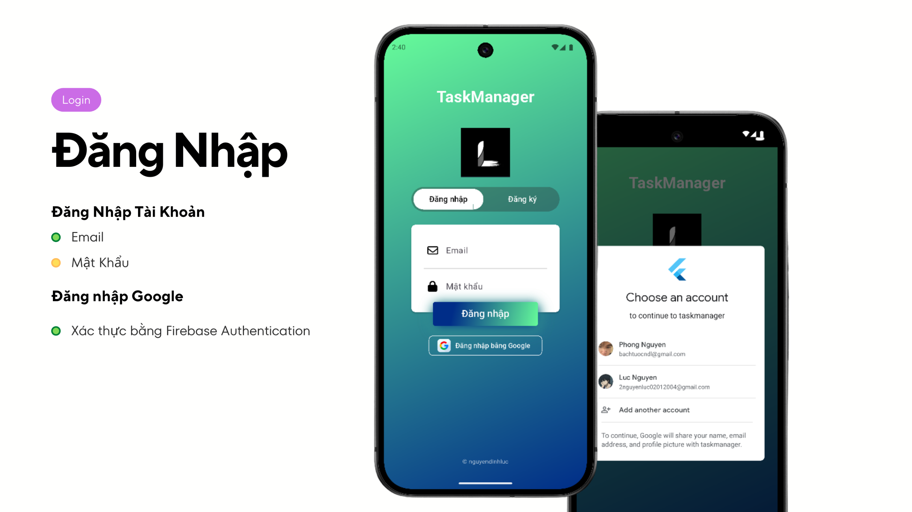
  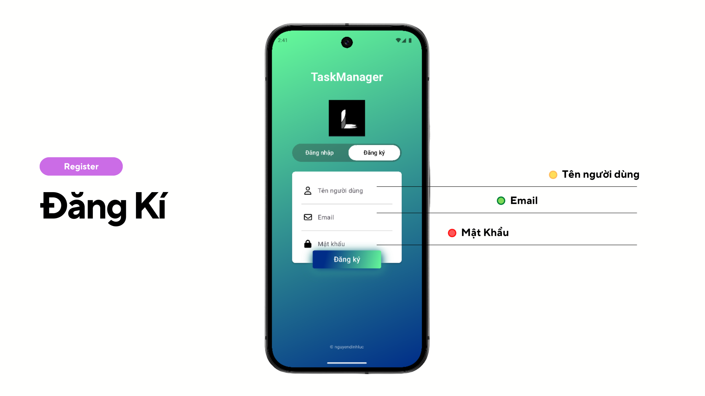
</p>

- Đăng nhập email/mật khẩu và **Đăng nhập bằng Google** (Firebase Authentication).
- Form đăng ký: tên người dùng, email, mật khẩu.

### Trang chủ

<p align="center">
  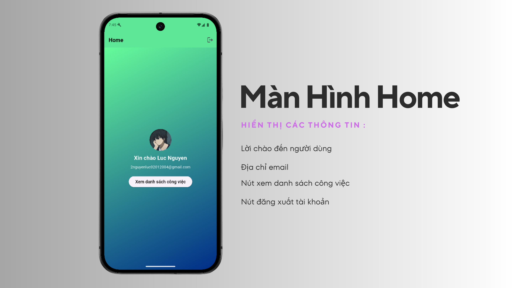
</p>

- Lời chào cá nhân hóa, avatar, email.
- Điều hướng nhanh tới danh sách công việc.

### Danh sách công việc — List & Kanban

<p align="center">
  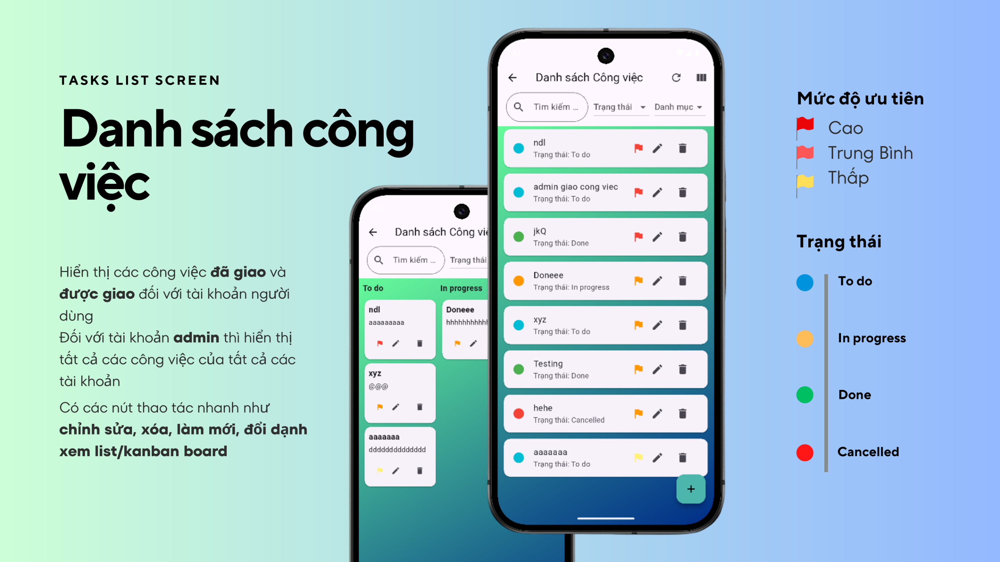
</p>

<p align="center">
  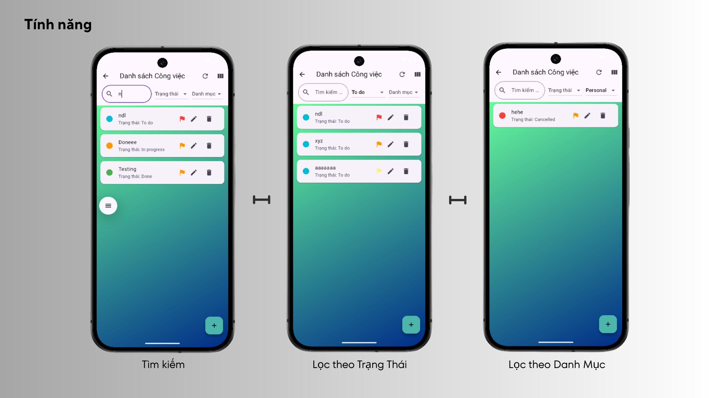
</p>

- Chế độ **danh sách** và **bảng Kanban** (To do · In progress · Done · Cancelled).
- Tìm kiếm, lọc trạng thái/danh mục, cờ ưu tiên, sửa/xóa nhanh.

### Chi tiết · Thêm · Sửa công việc

<p align="center">
  
  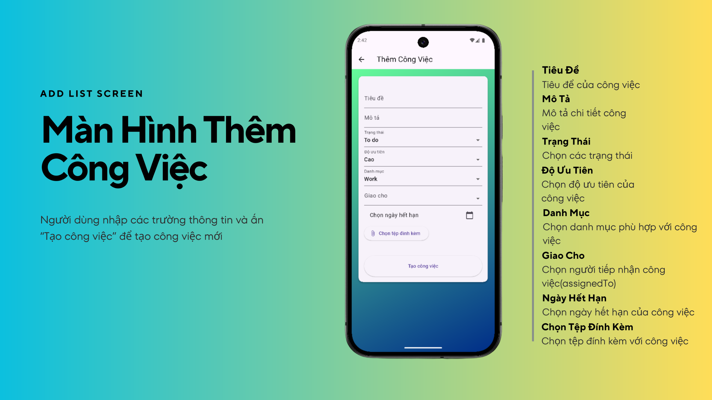
  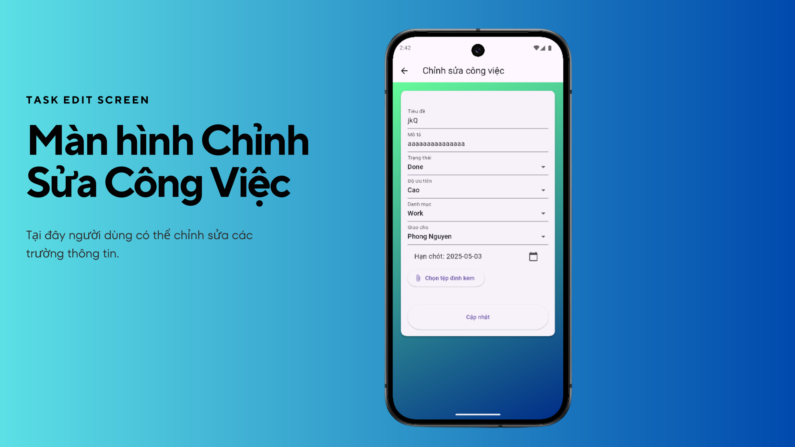
</p>

- Xem & đổi trạng thái, thông tin người giao/nhận, link tệp Dropbox.
- Form tạo/sửa đầy đủ trường và đính kèm file.

### Hạ tầng — Firebase & Dropbox

<p align="center">
  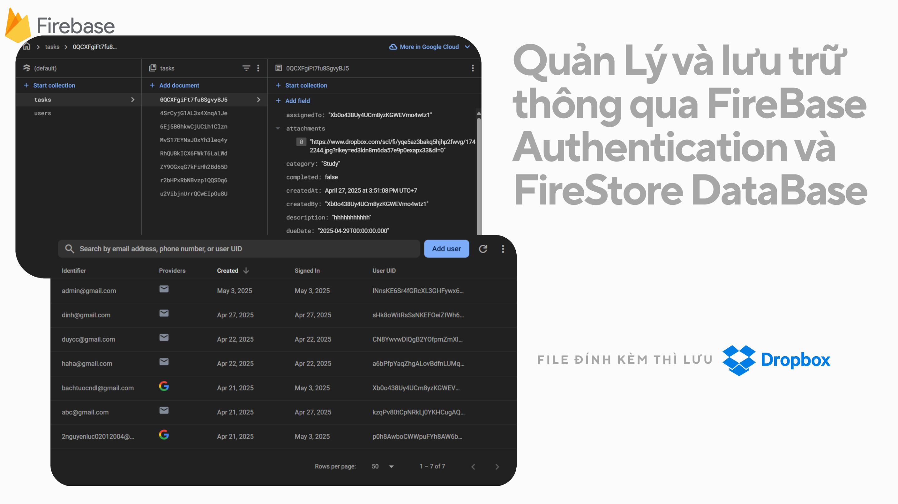
</p>

- **Firestore:** collection `users`, `tasks`.
- **Firebase Auth:** email + Google.
- **Dropbox:** lưu file đính kèm, URL lưu trong document task.

---

## Kiến trúc hệ thống

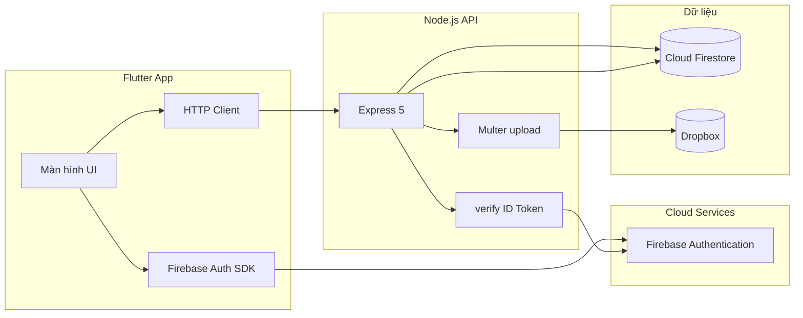

**Luồng điển hình — tạo task có file đính kèm:**

1. User đăng nhập → Firebase cấp **ID Token**.
2. Flutter gửi `multipart/form-data` tới `POST /api/tasks/create` kèm token.
3. API xác thực token, upload file lên **Dropbox**, lưu metadata + URL vào **Firestore**.

---

## Công nghệ sử dụng

### Mobile (Flutter)

| Gói | Mục đích |
|-----|----------|
| `firebase_core`, `firebase_auth` | Xác thực |
| `cloud_firestore` | Đọc thông tin user |
| `google_sign_in` | Đăng nhập Google |
| `http`, `mime_type` | Gọi REST API & upload file |
| `file_picker` | Chọn tệp đính kèm |
| `intl` | Định dạng ngày |
| `font_awesome_flutter` | Icon form |

### Backend (`task-manager-api-firebase`)

| Gói | Mục đích |
|-----|----------|
| `express` | REST API |
| `firebase-admin` | Firestore + verify token |
| `multer` | Nhận file upload |
| `dropbox` | Lưu trữ đính kèm |
| `cors`, `dotenv` | CORS & biến môi trường |

---

## Cấu trúc thư mục

```
TaskManagerApp/
├── lib/
│   ├── main.dart                 # Entry, khởi tạo Firebase
│   ├── models/                   # TaskModel, UserModel
│   ├── services/                 # Task API, UserService, Firebase options
│   └── view/                     # Login, Home, Task list/detail/form...
├── assets/images/                # Logo, Google icon
├── task-manager-api-firebase/      # Backend Node.js
│   ├── server.js
│   ├── routes/                   # auth.js, tasks.js
│   ├── middleware/               # Xác thực JWT Firebase
│   └── utils/dropbox.js
├── docs/screenshots/             # Ảnh demo (từ Review.pdf)
├── Review.pdf                    # Slide trình bày đầy đủ
└── README.md
```

---

## Cài đặt & chạy dự án

### Yêu cầu

- [Flutter SDK](https://flutter.dev/) (SDK `^3.7.0`)
- [Node.js](https://nodejs.org/) 18+
- Tài khoản **Firebase** (Auth + Firestore)
- Tài khoản **Dropbox** (App console + access token)
- Android Studio / emulator hoặc thiết bị thật

### 1. Clone repository

```bash
git clone https://github.com/<username>/TaskManagerApp.git
cd TaskManagerApp
```

### 2. Cấu hình Firebase (Flutter)

1. Tạo project trên [Firebase Console](https://console.firebase.google.com/).
2. Bật **Authentication** (Email/Password + Google).
3. Tạo **Firestore Database**.
4. Chạy FlutterFire CLI hoặc cập nhật `lib/services/firebase_options.dart` theo project của bạn:

```bash
flutter pub get
dart pub global activate flutterfire_cli
flutterfire configure
```

### 3. Chạy Backend API

```bash
cd task-manager-api-firebase
npm install
```

Tạo file `.env` (tham khảo — **không commit** file chứa secret):

```env
PORT=5000
DROPBOX_ACCESS_TOKEN=<dropbox_token>
```

Đặt file service account Firebase (ví dụ `serviceAccountKey.json`) theo cấu hình trong project backend (file `*.json` đã được `.gitignore`).

```bash
node server.js
```

API mặc định: `http://localhost:5000`

### 4. Cấu hình URL API trên Flutter

Trong `lib/services/task_api_service.dart`, chỉnh `_baseUrl` cho đúng môi trường:

| Môi trường | URL gợi ý |
|------------|-----------|
| Android Emulator | `http://10.0.2.2:5000/api/tasks` |
| iOS Simulator | `http://127.0.0.1:5000/api/tasks` |
| Thiết bị thật | `http://<IP-máy-tính>:5000/api/tasks` |

### 5. Chạy ứng dụng Flutter

```bash
flutter pub get
flutter run
```

### Gợi ý khi đẩy lên GitHub

- **Không** commit: `.env`, `serviceAccountKey.json`, `google-services.json` (nếu chứa secret), token Dropbox.
- **Nên** commit: `docs/screenshots/`, `Review.pdf`, mã nguồn, `README.md`.
- Thêm file `.env.example` mô tả biến cần thiết (tùy chọn).

---

## Tài liệu demo đầy đủ

| Tài nguyên | Mô tả |
|------------|--------|
| [Review.pdf](./Review.pdf) | Slide trình bày 12 trang (bản gốc) |
| [docs/screenshots/](./docs/screenshots/) | 12 ảnh PNG (`demo-01.png` … `demo-12.png`) trích từ PDF |

<details>
<summary>Xem tất cả ảnh demo (12 trang)</summary>

| # | Ảnh |
|---|-----|
| 1 |  |
| 2 | 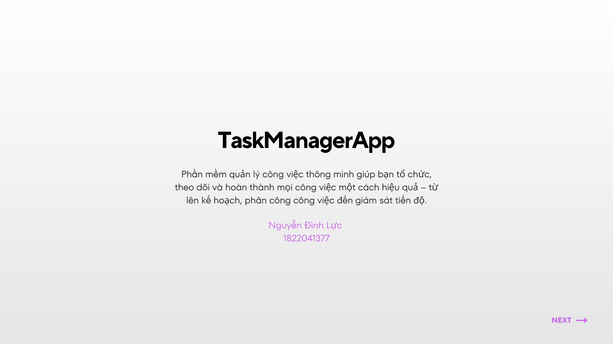 |
| 3 |  |
| 4 |  |
| 5 |  |
| 6 |  |
| 7 |  |
| 8 |  |
| 9 |  |
| 10 |  |
| 11 |  |
| 12 | 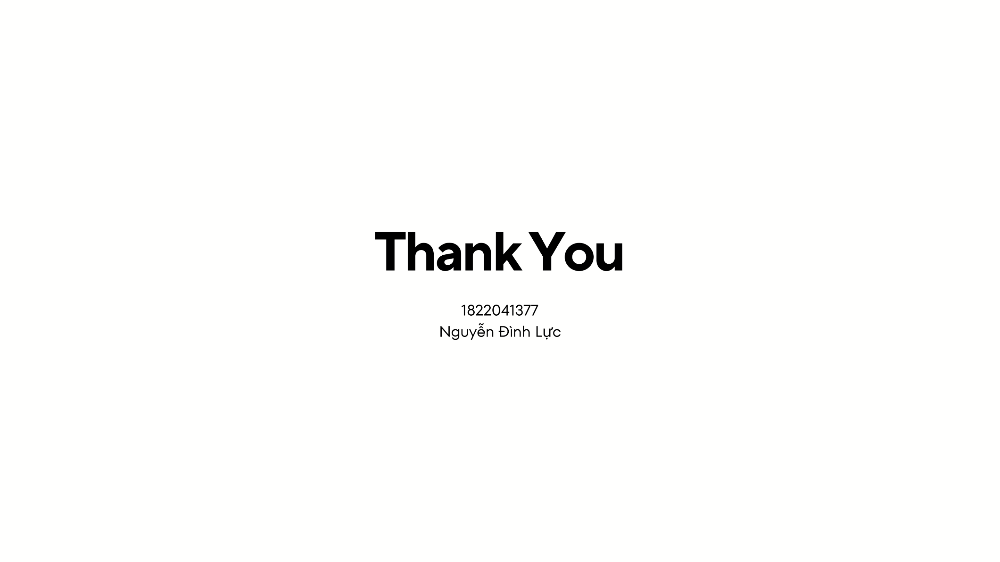 |

</details>

---

## Tác giả

**1uccc1uccc**


---


<p align="center">
  <sub>© nguyendinhluc · TaskManagerApp </sub>
</p>
